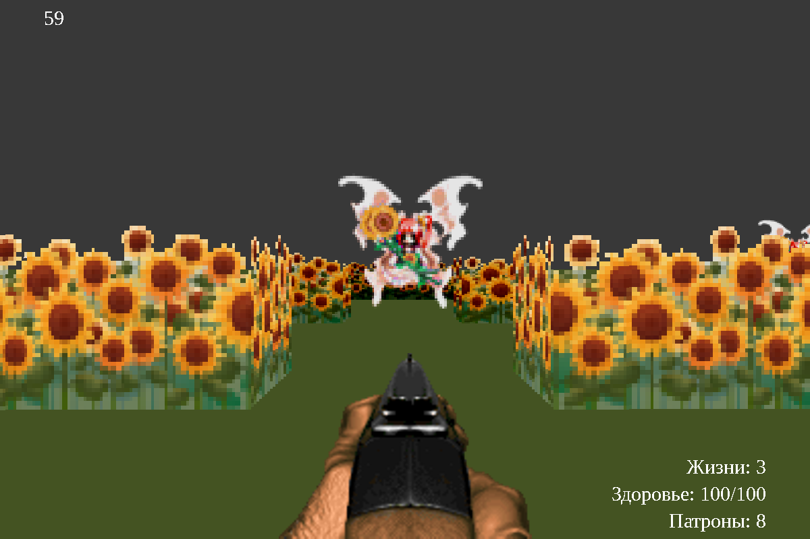

# PYGAME - ЗАДАНИЕ


**Поставленная задача** - Создать игру в стилистике шутеров от первого лица (FPS) начала 1990х годов, таких как Wolfenstein 3D и DOOM.

Для выполнения поставленной задачи требуется использовать средства визуализации PyGame, с помощью котороых нужно будет отобразить игру с псевдотрехмерной графикой и полноценным игровым циклом.

При разработке использовались аудио и видео материалы из следующих ресурсов:

- Wolfenstein 3D (id Software)
- DOOM (id Software)
- Touhou Project (Team Shanghai Alice)



**Запуск (пример для Linux):**
```bash
python -m venv venv
source venv/bin/activate
pip install -r requirements.txt
python -O __main__.py
```

